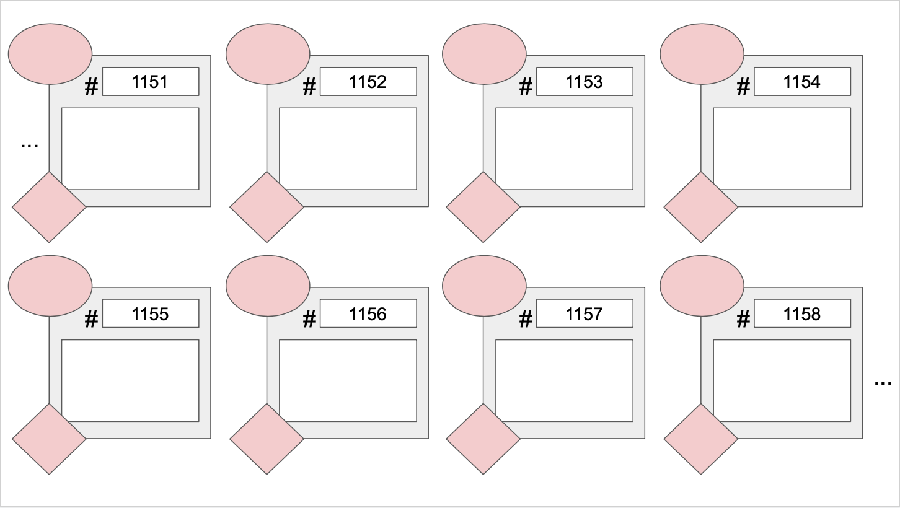

---


<p align="center"> <a href='https://youtu.be/6YJWDlFQyWc'>Recorded video</a> </p>

---

# C Memory Model and Arrays

---

## Memory Model in C

---

Memory in C can be thought of as a locker room! We have one locker for each variable, all locker boxes are numbered in increasing order and they can only be accessed by the right user.

Associated with each locker is important information like the memory address (locker number, which is unique), variable name, variable type and the variable value. Here's a picture you can keep in your mind:


---

Remember that lockers are created in memory automatically for:
- Declared variables
- Input parameters to functions
- Storing return values of functions

> In the next unit, we will learn about explicitly asking for some lockers in C!

---


Let's try an example and draw the diagram of the memory model for the following piece of code, right at the point where the result is returned (right before releasing the spaced reserved for the funcion)


- Remember that each function gets it's own area of lockers!

> If you haven't already, it would be a good time to go read the Unit 2 notes before attempting these yourself.

```c
#include<stdio.h>

float div_by_two(int s) {
    float result;
    result = s / 2;
    // Draw the memory model at this point!
    return result;      
}

int main() {
    int x, result;
    float y, z;
    
    x = 3;
    y = div_by_two(x)
    z = y + 3;
    
    result = z / 2;
    printf("The result is: %d\n", result);

    return 0;
}

```

If you're working digitally, you can use this template to draw on:



---

## Arrays & Strings

---

### Arrays

- Arrays are a fixed-size collection of contiguous boxes (in memory) of the same data type. 

- A *very* important thing to remember is that when arrays are passed to functions by telling its location in memory. This means that the function directly access and modifies the original array. It does **not** make a copy.

- Remember that unlike Python, C does not warn you about using out-of-bounds indeces so it is your responsibility to be careful on how you are indexing, otherwise you will access elements outside of the array.

---


### Strings

Strings are also known as arrays of characters, but with an special add-on: the end-of-string delimiter `\0`. The end-of-string delimiter indicates when the string ends.

Let's look at the following piece of code, what do you think it will print out?

```c
#include<stdio.h>

int main() {
    char original[1024] = "This is the original string!";
    char unoriginal[1024] = "And this is another string!";

    // We want `original` to be the same string as `unoriginal`
    original = unoriginal;
    printf("%s\n", original);

    return 0;
}
```

How about the following piece of code; what does it do?

```c
#include<stdio.h>

int main() {
    int array_one[10];
    int array_two[5];

    for (int i = 0; i < 5; i++){
        array_two[i] = i;
    }

    // We want to initialize the first 5 elements of array_one
    // to be the elements of array_two
    array_one = array_two;
    
    return 0;
}
```

As we could see, both of them do not compile. 

<details> 
  <summary>How can we fix them in order to make them work? </summary>
   - You have to do it yourself. If we want to make a copy of an array, we have to do it each element at once. We will see other build-in functions later, that can make our job easier.
</details>

---

# Exercise 

---

Write a function that takes two input strings and *swaps* their content. Note that the size of the arrays for each string is 1024, but the strings could have a different length.

Here's a template for you to complete:

```c
#include<stdio.h>

void swap( ... ) {
    ...
    return;
}

int main() {
    char first[1024] = "Christmas is in seven months!";
    char second[1024] = "It's beginning to look a lot like Christmas";

    printf("F: %s\nS: %s\n", first, second);
    // Expected:
    // F: Christmas is in seven months!
    // S: It's beginning to look a lot like Christmas

    swap(first, second);

    printf("F: %s\nS: %s\n", first, second);
    // Expected:
    // F: It's beginning to look a lot like Christmas
    // S: Christmas is in seven months!

    return 0;
}

```

---

## Let's go further

Write a function `strfind()` that *searches* for a given string in the specified main string, and returns the index of the first occurrence of the given string. If there is no match it returns `-1`. This will be extremely useful in your exercise 1. Here is some example output for this function:

```c
strfind("My name is Angela", "Angela") -> 11
strfind("My name is Mustafa", "Charles") -> -1
``` 

---


# Additional Exercises

---

These are not necessary, but give you an avenue to develop what you did in this tutorial further.

---


1. Once you have completed exercise 1, try to use the solution to implement a `replaceAllSubstrings()` function that replaces *every* occurence of a substring with something else. Implementation details are left up to you - you do not have to submit this.

2. Write a function that takes in a 2-dimensional array (ie, an array of arrays) representing a matrix, and then transposes it. [Here's some starter code.](transpose_matrix.c)

---
